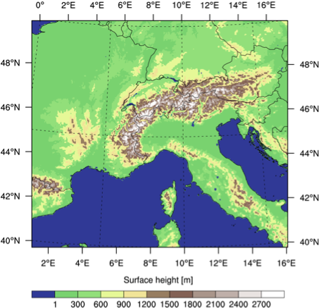

# CORDEX-FPSCONV Data

The CORDEX-FPSCONV dataset is a multi-model ensemble of convection permitting regional climate model runs created within [WCRP-CORDEX :material-open-in-new:](https://cordex.org/experiment-guidelines/flagship-pilot-studies/endorsed-cordex-flagship-pilote-studies/europe-mediterranean-convective-phenomena-at-high-resolution-over-europe-and-the-mediterranean/){:target="_blank"}.
The model runs are described in [Coppola et al. 2020 :material-open-in-new:](https://link.springer.com/article/10.1007/s00382-018-4521-8){:target="_blank"}, [Ban et al. 2021 :material-open-in-new:](https://link.springer.com/article/10.1007/s00382-021-05708-w){:target="_blank"} and [Pichelli et al. 2021 :material-open-in-new:](https://link.springer.com/article/10.1007/s00382-021-05657-4){:target="_blank"} and cover the ALP-3 domain.

{:target="_blank"}

So far, only the data from ETH (CLMcom-ETH-COSMO-crCLIM) has been CMORized (more info about this effort in this [pdf :material-open-in-new:](https://www.polybox.ethz.ch/index.php/s/cLZG0RkPipah6Uw){:target="_blank"}, for all other models the data format is a preliminary version (from ~September 2022) and not the one that will go to ESGF.
Currently, the data archive contains mainly 1-hourly precipitation and temperature and daily maximum temperature and minimum temperature.
These 4 variables have been used in three MSc theses and went through basic checks. The other variables (in 6hr, day) have been copied from the Jülich server but have not been used and were not checked.

Four different time periods are available:
* Evaluation: ca. 2000-2009 (varies for some models)
* Historical: ca. 1996-2005 (varies for some models)
* RCP8.5: 2041-2050 and 2090-2099 (not all modelling groups run both time periods) 

Each modelling group performed an evaluation run (precipitation is described in Ban et al. 2021).
Not all groups continued with historical and rcp8.5 runs.
The groups running WRF joined together to run historical and scenario runs (therefore they were sometimes run on different machines).

An overview of which variables are available for which runs can be found [at ETH's polybox :material-open-in-new:](https://www.polybox.ethz.ch/index.php/s/hVYniBtoaneP9Lc){:target="_blank"}.
More details about the different model runs, such as info about the driving RCM and domains, can be found [under this link :material-open-in-new:](https://www.polybox.ethz.ch/index.php/s/qDE3YAsFyruyyQw){:target="_blank"}.

## Data Availability
The data can be found at CSCS: `/store/c2sm/c2sme/CH202X/CORDEX-FPSCONV/ALP-3`

The data is mirrored daily to the IAC via `rsync` to: `/net/krypton/hyclimm_nobackup/CORDEX-FPSCONV/ALP-3`
